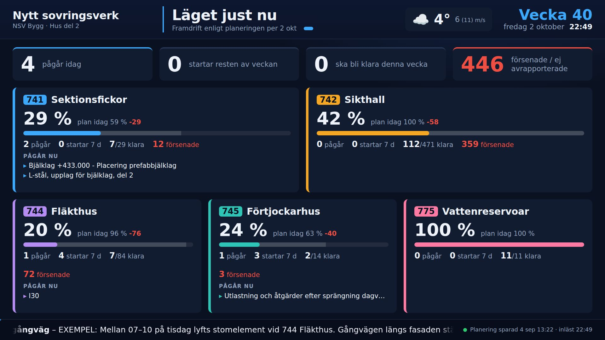

# Bodskärm

En informationsskärm för byggboden. Den visar 4-veckorsplaneringen, bilder från Trimble Connect, leveranser, hinder, väder, meddelanden och kontakter, och bläddrar automatiskt mellan vyerna.

**Du uppdaterar allt från din egen dator genom att spara Excel-filer.** Skärmen läser in dem igen inom ett par minuter via OneDrive. Det behövs ingen server, databas eller inloggning på skärmen.



| Vy | Innehåll | Källa |
|---|---|---|
| **Läget just nu** | Nyckeltal, framdrift mot plan per område, vad som pågår | 4-veckorsplaneringen |
| **Denna vecka** | Tidplan måndag–söndag, idag markerad | 4-veckorsplaneringen |
| **4 veckor framåt** | Tidplan fyra veckor, flera sidor vid behov | 4-veckorsplaneringen |
| **Startar & ska bli klart** | De närmaste 14 dagarna | 4-veckorsplaneringen |
| **Modell & ritningar** | Skärmbilder från Trimble Connect, APD-plan, ritningar, med QR-kod till modellen | Innehållsfilen + bildmappen |
| **Leveranser & lyft** | Per dag, med vindvarning för kranlyft | Innehållsfilen + väder |
| **Hinder & risker** | Öppna hinder sorterade efter allvarlighet | Innehållsfilen |
| **Väder** | Nu, kommande timmar, 7 dygn, vindbyar under arbetstid | Open-Meteo (gratis) |
| **Meddelanden & säkerhet** | Meddelanden, "dagar utan olycka", säkerhetsbudskap | Innehållsfilen |
| **Kontakter & nödläge** | Telefonlista, 112, återsamlingsplats, hjärtstartare | Innehållsfilen |

Längst ner rullar meddelanden som är markerade som "rullande", dagens leveranser och eventuell vindvarning.

---

## Så hänger det ihop

```
DIN DATOR                          ONEDRIVE / SHAREPOINT              BODEN
─────────                          ─────────────────────              ─────
4-veckorsplanering.xlsm  ──spara──►  Bodskarm/                ──synk──►  Mini-PC + TV
Bodskarm_Innehall.xlsx   ──spara──►    index.html, config.js            Edge i helskärm
skärmbilder från Trimble ──spara──►    data/ (Excel + bilder)           läser filerna var 2:a minut
```

Sidan är en vanlig HTML-fil som läser Excel-filerna direkt med biblioteket SheetJS. Webbläsaren i boden startas med en flagga som tillåter att lokala filer läses (`--allow-file-access-from-files`). Det ordnar startskriptet i `kiosk/`.

---

## Kom igång

### 1. Lägg mappen i OneDrive eller SharePoint
Kopiera hela mappen `bodskarm` till en plats som synkas, till exempel:

- **Rekommenderat:** ett dokumentbibliotek i projektets Teams- eller SharePoint-webbplats, t.ex. `Bodskarm`. Klicka på **Synkronisera** både på din dator och på boddatorn.
- Eller din egen OneDrive. Dela mappen med kontot som boddatorn är inloggad med och välj **Lägg till genväg i Mina filer** där.

> Använd gärna mappnamn utan å, ä och ö (`Bodskarm`). Det minskar risken för krångel med sökvägar.

### 2. Peka ut din 4-veckorsplanering
Öppna `config.js` i Anteckningar och ändra `planFil`:

```js
planFil: "data/NSV_Bygg_4veckorsplanering.xlsm",            // filen ligger i data-mappen
// eller
planFil: "C:/Users/bod/NCC/NSV - Dokument/Planering/4v.xlsm",  // absolut sökväg på boddatorn
```

Enklast är att planeringsfilen ligger i samma synkade mapp, under `data/`. Ligger den i ett annat SharePoint-bibliotek synkar du det biblioteket också på boddatorn och anger hela sökvägen.

Skärmen hittar själv alla områdesblad, det vill säga blad med kolumnerna **Aktivitet** och **Datum start** (741, 742, 744 …). Blad med RESURS, DP1, AKT och LISTOR i namnet hoppas över (se `planBladUndanta`). Nya områdesblad kommer med automatiskt.

### 3. Fyll i innehållsfilen
Öppna `data/Bodskarm_Innehall.xlsx`. Fliken **Läs mig** förklarar allt. Byt ut raderna märkta *EXEMPEL* mot riktiga uppgifter. Viktigast:

- **Inställningar:** projektnamn, **Latitud/Longitud** (högerklicka på byggplatsen i Google Maps), vindgräns för lyft och nödinformation.
- **Kontakter:** riktiga namn och nummer.

### 4. Testa på din egen dator
Dubbelklicka på `kiosk\Forhandsgranska.bat`. Sidan öppnas i ett fönster.
**← / →** byter vy, **mellanslag** pausar och **R** läser om Excel-filerna direkt.

### 5. Ställ i ordning datorn i boden
1. En mini-PC med Windows 10/11, kopplad till TV:n med HDMI.
2. Logga in med projektets konto och synka mappen (steg 1). Högerklicka på mappen och välj **Behåll alltid på den här enheten**.
3. Dubbelklicka på `kiosk\Installera autostart.bat`. Då startar skärmen vid inloggning, och vila och skärmsläckare stängs av.
4. Ställ in automatisk inloggning i Windows och gärna "starta efter strömavbrott" i BIOS.
5. Starta om. Skärmen kommer upp i helskärm efter ungefär 30 sekunder. Avsluta med **Alt+F4**.

---

## Vardagen

| Jag vill … | Gör så här |
|---|---|
| Uppdatera tidplanen | Jobba i 4-veckorsplaneringen som vanligt och spara. |
| Säga något till alla | Ny rad på fliken **Meddelanden**. `Rullande text = Ja` lägger den också i textremsan. |
| Visa en ny vy ur modellen | Spara en skärmbild i `data/bilder` och lägg till en rad på fliken **Bilder**. |
| Lägga in en leverans eller ett lyft | Ny rad på fliken **Leveranser**. `Kranlyft = Ja` ger vindvarning. |
| Stänga av eller byta ordning på vyer | Fliken **Vyer**: Visa, Sekunder, Ordning. |
| Visa något bara under en period | Kolumnerna *Visa från / Visa till* på Meddelanden och Bilder. |

Ändringarna syns normalt inom **2–3 minuter**: OneDrive-synk plus skärmens inläsning var 2:a minut. I sidfoten står när planeringen senast sparades och när den lästes in. En **röd prick** betyder att en fil inte kunde läsas. Skärmen visar då det som senast lästes in.

### Bilder från Trimble Connect
1. Ställ in vyn i Trimble Connect och spara den som en vy, så att du hittar tillbaka.
2. Ta en skärmbild (**Win + Shift + S**) och spara som PNG eller JPG i `data/bilder`.
3. Klistra in länken till modellen eller vyn i kolumnen **Länk**. Skärmen visar då en QR-kod så att man kan öppna modellen i mobilen.
4. Tips: skriv över samma filnamn när du uppdaterar en vy, så behöver Excel-raden inte ändras.

---

## Felsökning

| Problem | Lösning |
|---|---|
| "Kunde inte läsa Excel-filerna" | Starta via `kiosk\Starta bodskarm.bat` och inte genom att dubbelklicka på `index.html`. Kontrollera `planFil` i `config.js`. |
| Ändringar syns inte | Är OneDrive igång och synkat på boddatorn (molnikonen)? Är filen sparad, inte bara autosparad lokalt? |
| Vädret syns inte | Fyll i Latitud och Longitud under Inställningar. Boddatorn behöver internet. |
| Många "Försenad" | Aktiviteter vars slutdatum passerat utan 100 % i *Framdrift %* räknas som försenade. Rapportera framdrift, eller sätt `visaForsenade: false` i `config.js`. |
| För många rader per sida | Ändra `raderPerSida` i `config.js`. |
| Fel datum eller vecka vid test | Lägg till `?datum=2026-10-12` efter `index.html` i adressen för att låtsas att det är en annan dag. |

---

## Bygga vidare

```
bodskarm/
├── index.html              sidan (laddar alla skript)
├── config.js               sökvägar och tekniska inställningar
├── css/bodskarm.css        allt utseende (1920×1080, skalas till skärmen)
├── js/
│   ├── util.js             datum, veckonummer, Excel-värden, QR
│   ├── data.js             läser planeringen + innehållsfilen → datamodell
│   ├── gantt.js            tidplansdiagrammet
│   ├── vader.js            väder från Open-Meteo
│   ├── app.js              rotation, sidhuvud, textremsa, omläsning
│   ├── vyer/               en fil per grupp av vyer
│   └── lib/                SheetJS (Excel) och qrcode-generator
├── data/
│   ├── Bodskarm_Innehall.xlsx
│   └── bilder/
├── kiosk/                  startskript för Windows
└── verktyg/skapa_innehallsfil.py   återskapar en tom innehållsmall
```

### Lägga till en egen vy
1. Skapa `js/vyer/minvy.js`:
   ```js
   Bod.vyer.registrera({
     id: "minvy",
     titel: "Min vy",
     sidor: function (ctx) {
       // ctx.plan.aktiviteter, ctx.innehall, ctx.vader, ctx.idag, ctx.inst("Namn"), ctx.status(a)
       return [{ undertitel: "Något", html: "<h2>Hej bygget!</h2>" }]; // tom lista = hoppa över vyn
     }
   });
   ```
2. Lägg till `<script src="js/vyer/minvy.js"></script>` i `index.html`, före `app.js`.
3. Lägg till en rad med Vy-id `minvy` på fliken **Vyer** i innehållsfilen.

Varje aktivitet ur planeringen ser ut så här:
`{ omrade: {kod, namn}, del, aktivitet, typ, start, slut, dagar, dp, block, ata, helg, framdrift (0–1), preliminar, milstolpe }`

### Idéer för nästa steg
- **Bemanning:** läs `RESURSÖVERSIKT`-bladen och visa antal personer per vecka.
- **Trimble Connect API:** hämta ärenden (Topics/BCF) automatiskt. Det kräver en app-registrering hos Trimble.
- **Fler skärmar:** lägg till en URL-parameter som filtrerar tidplanen på ett område, så kan varje bod visa sitt eget.

---

### Tekniskt
- Körs helt i webbläsaren. Inga beroenden behöver installeras på boddatorn.
- SheetJS 0.18.5 (Apache 2.0) och qrcode-generator 1.4.4 (MIT) ligger i `js/lib/`, så sidan fungerar även om nätet går ner. Bara vädret kräver internet, och den senaste prognosen sparas.
- Sidan laddar om sig själv varje natt kl 04:00 (`omstartKlockan`), så kodändringar som synkats via OneDrive kommer med automatiskt.
